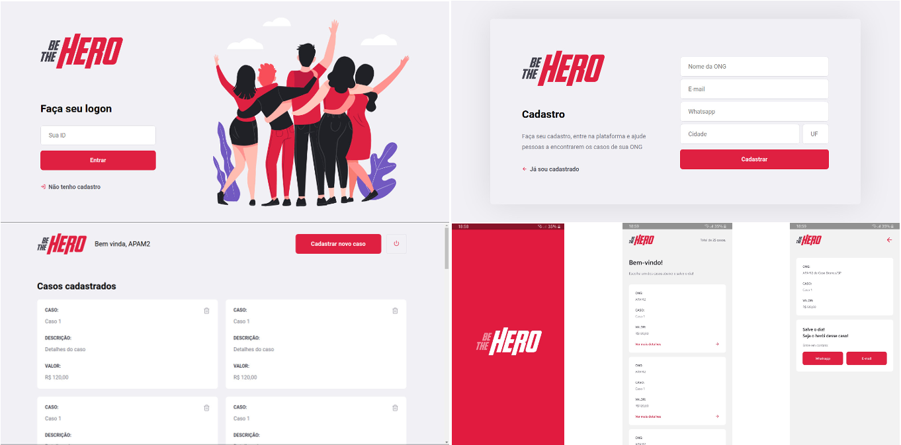

# Be The Hero
> Este projeto foi desenvolvido durante a Semana OmniStack #11, ministrada pela RocketSeat.

O projeto foi desenvolvido a fim de estudo, utilizando node.js para o backend, ReactJS para o frontend e ReactNative para o mobile.

Este projeto consiste em um app que ajuda ongs a captar recursos para solucionar seus problemas. Uma ong se cadastra no sistema e a partir dai pode criar os casos em quem precisa de ajuda. Um herói disposto a ajudar, pode buscar através de seu app os casos disponíveis, escolher um e salvar o dia.

 

## Instalação
Instalar e iniciar Servidor da API (Backend da aplicação)

```sh
cd backend
```

```sh
npm install
```

```sh
npm start
```

Instalar e iniciar App ReactJS (Frontend da aplicação)

```sh
cd frontend
```

```sh
npm install
```

```sh
npm start
```

Após o servidor ter iniciado acessar http://localhost:3000

Instalar e iniciar App ReactNative (Aplicação mobile)

Para testar a versão mobile, é necessário instalar o App Expo disponível para Android e IOS.

```sh
cd mobile
```

```sh
npm instal
```

```sh
npm start
```

Após iniciar o server mobile, abrir o app Expo no celular e escanear o QRcode mostrado em terminal.


## Configuração para Desenvolvimento

Para rodar os testes unitários e integrados da aplicação, navegar para a pasta backend, iniciar o servidor `npm start` e rodar o teste com `npm test`.
